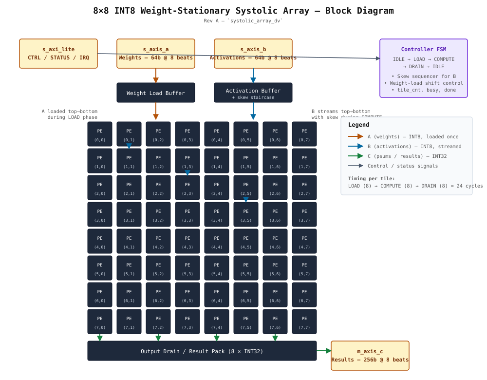

# systolic_array_dv

**A UVM verification environment for an 8×8 INT8 weight-stationary systolic-array matrix-multiply accelerator** — built and closed on an open-source toolchain (Verilator + UVM), with functional and code coverage, a 500-seed regression, three independent reference models, and a control-plane formal track.


> **Status:** Dynamic verification complete — functional coverage closed, code coverage gaps waived with rationale, multi-seed regression green. Control-plane formal properties are authored; exhaustive proof is pending an SV-capable formal frontend (see [Formal](#7-formal-track)).

---

## 1. What this is

An 8×8 INT8 systolic-array accelerator — the compute primitive at the heart of ML accelerators — verified to closure with a full UVM environment. The DUT is a complete weight-stationary datapath with a real control plane: a seven-state controller FSM, AXI4-Stream data and AXI4-Lite control, de-skewed output capture, and software-commanded abort. Verification is the focus of the project, and it reaches closure — coverage closed, a 500-seed regression green, and three independent references agreeing on every tested input.

What it demonstrates:

- A UVM environment with constrained-random stimulus, a self-checking scoreboard, and a manually-built functional-coverage model — running end to end on **Verilator**, which most people assume can't host UVM.
- **Three independent, cross-validated reference models** (NumPy, a cycle-accurate simulator, and C++) so that a scoreboard mismatch isolates to the RTL rather than to an ambiguous golden.
- **Coverage-driven closure**: 100% functional coverage on a curated bin set, 97.1% line coverage with every gap waived and explained.
- A **500-seed regression** with a vacuous-pass guard, driven by a pure-stdlib Python framework.
- A **control-plane formal track** (SVA assertions + cover properties) targeting the controller FSM and handshakes.

A short note on methodology, since it shaped the whole project: the cycle-accurate model caught a dataflow (partial-sum direction) error in the original spec **before any RTL was written**. The full development workflow — including how AI tooling was and wasn't used — is in [`docs/ai_workflow.md`](docs/ai_workflow.md).

## 2. Architecture



### DUT — `systolic_top`

| Parameter        | Value                                              |
| ---------------- | -------------------------------------------------- |
| Array            | 8×8 processing elements, weight-stationary         |
| Datatype         | INT8 × INT8 → INT32 accumulate                     |
| Data interface   | AXI4-Stream (A, B in; C out)                       |
| Control          | AXI4-Lite CSR block                                |
| Tile latency     | 8 load + 8 compute + 8 drain                       |
| Overflow         | Mathematically impossible for 8×8 INT8; status bit tied off (out of scope) |

**Dataflow (weight-stationary, TPU-style):** weights are preloaded into the PEs; B flows down the columns; partial sums propagate right along the rows; C exits the right edge. De-skew is handled by capturing `C[r][c]` at compute cycle `r + c + N − 1`, accounting for the one-cycle registered-output delay.

**Controller FSM:** `IDLE → RECV_A → LOAD → WAIT_B → COMPUTE → OUTPUT → DONE`. `busy = (state != IDLE)`; `done` is a one-cycle pulse.

### CSR map (AXI4-Lite)

| Offset | Register  | Access | Notes                                             |
| ------ | --------- | ------ | ------------------------------------------------- |
| `0x00` | `CTRL`    | RW     | bit0 `start` (set-when-idle, auto-clears on done); bit1 `soft_reset` (self-clearing 1-cycle pulse) |
| `0x04` | `STATUS`  | mixed  | bit0 `busy` (RO); bit1 `done` (sticky / W1C); bit2 `overflow` (RO, tied 0) |
| `0x08` | `TILE_CNT`| RO     | tiles completed                                   |
| `0x0C` | `IRQ_EN`  | RW     | interrupt enable                                  |
| `0x10` | `VERSION` | RO     | `0x0001_0000`                                     |

`start`-while-busy is **ignored** by design (defensive — it protects the running tile). `soft_reset` is OR'd into the controller reset only (`ctrl_rst = rst | soft_reset`), so an abort flushes the datapath while the CSR state survives.

## 3. Verification approach

**Reference strategy.** The scoreboard's golden is an SV behavioral model that predicts C from the *monitored* A and B tiles. The same matmul is independently implemented and unit-tested three more ways — `ref/python/golden.py` (NumPy), `ref/python/systolic_sim.py` (cycle-accurate), and `ref/cpp/matmul_ref.cpp` (C++) — and cross-checked against each other (`ref/cpp/crosscheck.py`). Because the references agree, a scoreboard mismatch points at the RTL, not the model.

**Checks (three, independent):** end-of-tile data compare against the golden; a latency window per tile; and AXI4-Stream protocol checks (valid/ready legality, TLAST placement) independent of data correctness.

**Coverage model** (see [`docs/verification_plan.md`](docs/verification_plan.md) for the full plan and traceability matrix): operand range per A/B (CP1), result magnitude (CP2), output backpressure (CP3), tile spacing (CP4), CSR access (CP5), plus the `A_range × B_range` and `backpressure × tile_spacing` crosses. Bins are curated — unreachable/illegal combinations are excluded so the percentage reflects intent, not padding.

```
                       env
   ┌──────────────┬──────────────┬──────────────┬───────────────┐
 axis_agent A   axis_agent B   axis_agent C    axil_agent (CSR)
 drive+monitor  drive+monitor  monitor +        drive+monitor
                               TREADY responder
   └──────────────┴──────┬───────┴──────────────┴───────────────┘
                         ▼
                   scoreboard  ── SV golden matmul ── compare C
                         │
                   coverage collector (manual hit-counter bins)
```

The environment lives in a single package, `tb/uvm/systolic_uvm_pkg.sv`. Two top levels share it: `tb_top` (full DUT, start issued via a real CSR write) and `tb_ctrl` (controller-level bring-up). The agent/scoreboard structure is reused from a prior `AXI_RAM_Verification` UVM project; the AXI4-Lite agent adapts that full-AXI4 environment to Lite single transfers.

A **directed-test layer** (`tb/tb_*.sv`, with stimulus generated by `tb/generate_stimulus.py` and `tb/gen_controller_vectors.py`) brought up each block — PE, array, controller, CSR — before the UVM environment went on top.

## 4. Results

| Metric | Result |
| ------ | ------ |
| Functional coverage | **100%** (CP1–CP5, both crosses) |
| Code coverage (DUT RTL) | line **97.1%** (33/34), branch 93.8%, expr 94.3%, toggle 92.1% |
| Regression | **1,500 runs** (3 tests × 500 seeds), **0 failures, 0 vacuous passes** |
| Multi-tile scenario run | 36 tiles, 36 checked, **0 mismatches** |

Code-coverage gaps are waived with rationale, not forced: the `$warning` TLAST path and the `ifndef SYNTHESIS` block, the unreachable `default` FSM arm, the constant `bresp`/`rresp` = OKAY, the tied-off overflow path, and the unused IRQ path. Verilator does not auto-extract FSM state/transition coverage on this design, so case-arm branch coverage stands in for it.

## 5. Repository layout

```
systolic_array_dv/
├── rtl/                        DUT
│   ├── pe.sv  systolic_array.sv  controller.sv  csr.sv  systolic_top.sv
│   └── controller.sby          formal config (control-plane)
├── tb/                         directed bring-up testbenches + stimulus gen
│   ├── tb_controller.sv  tb_csr.sv  tb_systolic_array.sv  tb_systolic_top.sv
│   ├── generate_stimulus.py  gen_controller_vectors.py
│   ├── stimulus.txt  controller_vectors.txt
│   └── uvm/                    UVM environment
│       ├── systolic_uvm_pkg.sv     env, agents, scoreboard, coverage
│       ├── axis_if.sv  axil_if.sv  ctrl_if.sv
│       ├── tb_top.sv  tb_ctrl.sv   two top levels, shared package
│       ├── makefile                one build, runtime test selection
│       ├── coverage.vlt            code-coverage scoping (DUT RTL only)
│       └── regression/             seeded regression framework (stdlib only)
│           └── regress.py  log_parser.py  cov_parser.py
├── ref/                        cross-validated reference models
│   ├── python/  golden.py (NumPy)  systolic_sim.py (cycle-accurate)  + tests
│   └── cpp/     matmul_ref.{cpp,h}  crosscheck.py  + test
└── docs/        verification_plan.md  spec.md  ai_workflow.md  bugs.md  block_diagram.svg
```

## 6. Build & run

**Prerequisites:** Verilator 5.048+, a UVM-core source tree, Python 3 (stdlib only — no packages).

Set `UVM_SRC` to your UVM-core `src/` directory (or pass it per invocation). All UVM commands run from `tb/uvm/`:

```bash
cd tb/uvm

make top_tile_test    UVM_SRC=/path/to/uvm-core/src   # one tile, full DUT (CSR-started)
make multi_tile_test  UVM_SRC=...                      # full scenario suite (36 tiles)
make single_tile_test UVM_SRC=...                      # controller-level bring-up
make multi_tile_test  UVM_SRC=... DBG=1                # verbose trace
make coverage         UVM_SRC=...                      # code-coverage build + report
make clean

python3 regression/regress.py                          # seeded multi-test regression
```

The reference models build and self-test independently:

```bash
cd ref/cpp && make && ./test_matmul_ref      # C++ reference + unit test
python3 ref/python/test_golden.py            # NumPy golden test
python3 ref/python/test_systolic_sim.py      # cycle-accurate sim test
```

**A note on warnings:** under the required `+define+UVM_NO_DPI`, UVM's IEEE-1800.2 component-name validator emits spurious `UVM/COMP/NAME` warnings (54 on the controller binary, 74 on the top). They are benign and elaboration-only; the makefile filters them from normal output. This is documented rather than suppressed in source.

## 7. Formal track

Control-plane properties are authored in `rtl/controller.sv` under `` `ifdef FORMAL `` (config in `rtl/controller.sby`): FSM state and counter-bound invariants, reset behaviour, and the producer/consumer guarantee that entering `COMPUTE` implies B has been fully received — plus `cover` properties proving every FSM phase is reachable (guarding against vacuous assertions). The 64-MAC datapath is deliberately out of scope for formal (intractable for a solver and already covered dynamically).

**Proof status:** the properties are written but not yet proven, because the local open-source flow lacks a SystemVerilog-capable yosys frontend — the native frontend can't parse the design's unpacked-array ports, and sv2v converts the RTL but strips the assertions. The path to closing this is a yosys with `read_systemverilog` (OSS CAD Suite), which reads the original `controller.sv` and its assertions directly.

## 8. Scope boundaries

Explicitly **out of scope**, by design decision rather than omission:

- **Autonomous error detection / error-injection** — the DUT aborts on a software command (`soft_reset`), not on hardware-detected errors. With no detection feature, an error-injection sequence would have nothing to verify; adding half-baked detection RTL was declined to keep every claimed feature fully verified.
- **DPI-C scoreboard reference** — the SV golden is the live reference; importing the proven C++ model directly via DPI-C is future work.
- **Overflow detection** — impossible for the 8×8 INT8 case; the status bit is tied off.
- **K-tiling, bias/activation, multiple precisions, sparsity** — not in the datapath.
- **Mid-stream input backpressure recovery** — backpressure is handled at tile granularity.

## 9. Documentation

- [`docs/verification_plan.md`](docs/verification_plan.md) — full vplan: feature/coverage traceability, checking strategy, closure criteria.
- [`docs/spec.md`](docs/spec.md) — DUT specification.
- [`docs/ai_workflow.md`](docs/ai_workflow.md) — development process and how AI tooling was used.
- [`docs/bugs.md`](docs/bugs.md) — bug log (the two testbench bugs the regression and golden caught).
- [`docs/block_diagram.svg`](docs/block_diagram.svg) — DUT block diagram.

## 10. Author

**Jaishyam Reddy Reddivari** — MS Computer Engineering, Syracuse University. Boston, MA.
Open to entry-level DV / ASIC verification roles in the US.

## License

MIT — see [LICENSE](https://github.com/JaishyamReddivari/systolic_array_dv/blob/main/LICENSE).